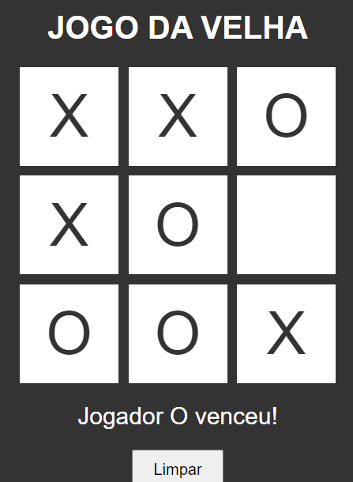

# PROJETO-JOGO-DA-VELHA
🎈JOGO DA VELHA COM HTML, CSS E JS.

 <br>

## DESCRIÇÃO:
O "Jogo da Velha" é um projeto que consiste em um jogo clássico de tabuleiro para dois jogadores. Neste repositório, o jogo foi implementado utilizando tecnologias web.
O projeto possui as seguintes funcionalidades:
- **Iniciar o jogo**: Ao carregar a página, é possível selecionar o modo de jogo entre "Jogar Sozinho" e "Jogar com Alguém".
- **Escolher células**: Cada célula do tabuleiro é clicável e representa uma jogada. Os jogadores podem clicar nas células para marcar seu movimento.
- **Alternar entre jogadores**: Os jogadores são representados pelos símbolos "X" e "O". A cada jogada, o símbolo atual é alternado automaticamente.
- **Verificar vitória**: O jogo verifica se algum jogador venceu, comparando as células marcadas nas combinações vencedoras. Se houver um vencedor, o jogo é encerrado e exibe uma mensagem com o resultado.
- **Verificar empate**: Se todas as células forem preenchidas e não houver um vencedor, o jogo é considerado um empate.
- **Reiniciar o jogo**: Após o término do jogo (vitória ou empate), é possível reiniciar o jogo clicando no botão "Limpar". O tabuleiro é limpo, e os jogadores podem iniciar uma nova partida.

## COMO USAR?
1. Clone o repositório para o seu sistema local:

```bash
git clone https://github.com/VILHALVA/JOGO-DA-VELHA.git
```

* Navegue até o diretório do projeto.

```bash
cd JOGO-DA-VELHA
```

* Descompacte o arquivo ZIP (se você baixou manualmente):

```bash
unzip JOGO-DA-VELHA.zip
```
2. Abra o arquivo `JOGO DA VELHA.html` em seu navegador de preferência.
3. A página do Jogo da Velha será carregada.
4. Selecione o modo de jogo clicando no botão "Jogar Sozinho" ou "Jogar com Alguém".
5. Clique nas células do tabuleiro para fazer suas jogadas.
6. O jogo irá alternar automaticamente entre os jogadores e verificar se alguém venceu ou se houve um empate.
7. Após o término do jogo, você pode reiniciar clicando no botão "Limpar" para começar uma nova partida.

## CREDITOS:
- [PROJETO CRIADO PELO VILHALVA](https://github.com/VILHALVA)

